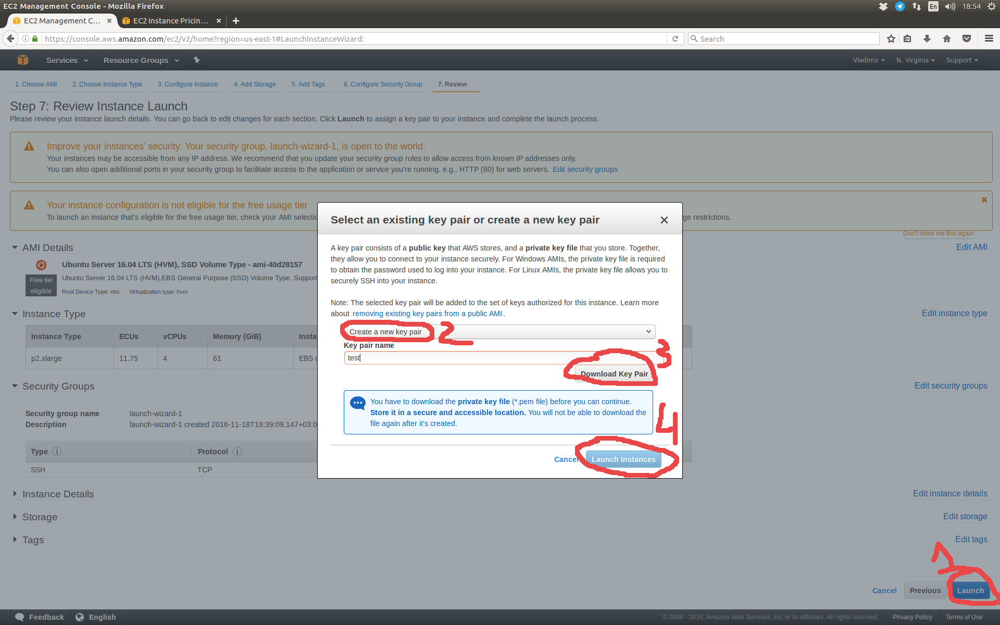

# Amazon EC2

This document is the short tutorial showing how to choose, launch and use your first Amazon EC2 instance for deep learning.

## Intro

Here are the list of basic resources to look at:
* [Tutorial](http://docs.aws.amazon.com/AWSEC2/latest/UserGuide/EC2_GetStarted.html) on using Amazon EC2 instances.
* [Instance types](https://aws.amazon.com/ec2/instance-types/) and their [pricing](https://aws.amazon.com/ec2/pricing/on-demand/).

Recently Amazon has introduced [*P2*](https://aws.amazon.com/blogs/aws/new-p2-instance-type-for-amazon-ec2-up-to-16-gpus/) group of instances designed especially for deep learning. 

I suggest using *P2.xlarge* instance which is available at *US East (N. Virginia)* hub at a price of $0.9 per hour. It has one NVIDIA K80 (12 GiB GPU memory) and 4 CPUs on board.

## Step by step instructions

1. Go to [AWS](https://aws.amazon.com/) and create an account (or log in if you already have one). Amazon requires to provide credit card info. 
  
  
  
2. After creating an account (or logging in) go to [AWS console](https://console.aws.amazon.com/).
  
  
  
3. Choose *North Virginia* hub and then proceed to the instance creation process. 
  
  
  
4. Select *Ubuntu Server* AMI (or another one if you know exactly what to choose, [here's](http://docs.aws.amazon.com/AWSEC2/latest/UserGuide/AMIs.html) the brief overview) to initialize fresh instance with this system. 

  
  
5. It's time to choose the instance type. Let's take *p2.xlarge* in accordance with my previous recommendation. Now you do not need to change other options (you can change all of them later), but you can guide through them just to take a look or if you are an experienced user and know what to change. 

  
  
6. Now almost everything is ready. The only thing to do is to create the ssh key pair to be able to access the server. Press "Launch" button at the right bottom corner and create the new pair (or choose the existing one if you used amazon ec2 before and have feasible key pair). 
  
  

In both cases one can connect to the instance via [ssh](http://docs.aws.amazon.com/AWSEC2/latest/UserGuide/AccessingInstancesLinux.html).

To forward the jupyter notebook interface to your laptop and anywhere you want:
* First you need to launch it at the Amazon instance
```
nohup jupyter notebook --port=8888 & disown
```
Here *nohup* supresses some technical output and *disown* deattaches the process from user so you can abort the ssh connection and jupyter will still run.

If you use docker just launch the container with the 8888 port exposed (default in *start.sh*).
* Then you need to forward an *ssh-tunnel* from your local machine to the Amazon instance
```
ssh -N -f -L localhost:9999:localhost:8888 <user>@<server>
```
Now you should be able to access jupyter notebook interface via web-browser at the address
```
localhost:9999
```
