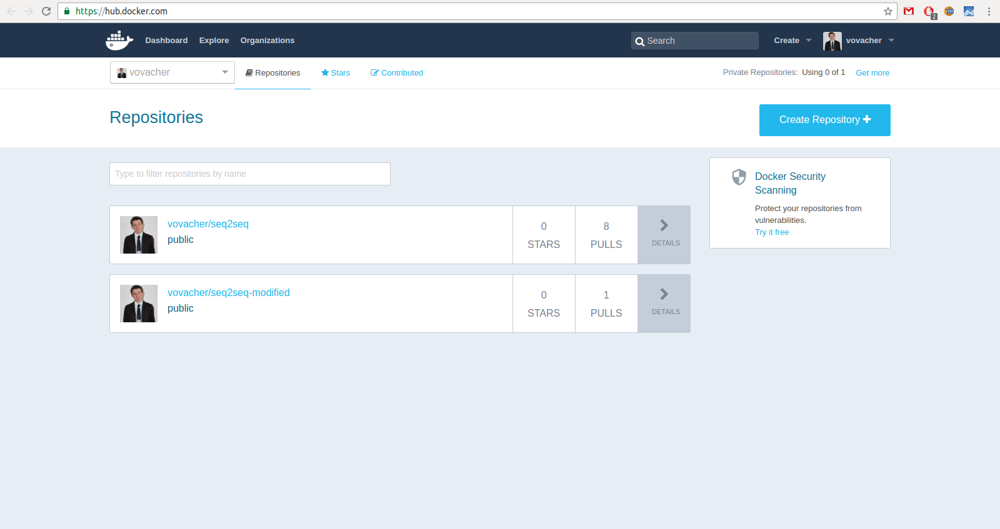

# Docker

Here one can find a short manual on how to use Docker containers.

1. [Installation](#installation)  
	1.1 [Docker](#docker)  
	1.2 [Nvidia-docker](#nvidia-docker)  
2. [General info](#general-info)
3. [Building your own image](#building-your-own-image)  
	3.1. [Dockerfile](#dockerfile)  
	.......3.1.1 [Dockerfile creation](#dockerfile-creation)  
    	.......3.1.2 [Building an image from Dockerfile](#building-an-image-from-dockerfile)  
	3.2 [Commit](#commit)
4. [Pushing to Hub](#pushing-to-hub)
5. [Managing Images and Containers](#managing-images-and-containers)  
	5.1 [Get image](#get-image)  
	5.2 [List all images](#list-all-images)  
	5.3 [Remove image](#remove-image)  
	5.4 [Start container](#start-container)  
	5.5 [List containers](#list-containers)  
	5.6 [Remove container](#remove-container)  
6. [Usage](#usage)
7. [Automated usage](#automated-usage)  
	7.1 [Start](#start)  
	7.2 [Stop](#stop)  

## [Installation](#installation)

### [Docker](#docker)

Here I provide detailed set of instructions only for *Ubuntu 16.04*. For any other distro please take a look into [official guides](https://docs.docker.com/engine/installation/).

Installation instructions are adapted from [official page](https://docs.docker.com/engine/installation/linux/ubuntulinux/).

### Update your apt sources

Docker's `APT` repository contains Docker 1.7.1 and higher. To set `APT` to use
packages from the Docker repository:

1.  Log into your machine as a user with `sudo` or `root` privileges.

2.  Open a terminal window.

3.  Update package information, ensure that APT works with the `https` method, and that CA certificates are installed.

    ```bash
    $ sudo apt-get update
    $ sudo apt-get install apt-transport-https ca-certificates
    ```

4.  Add the new `GPG` key.

    ```bash
    $ sudo apt-key adv --keyserver hkp://ha.pool.sks-keyservers.net:80 --recv-keys 58118E89F3A912897C070ADBF76221572C52609D
    ```

5.  Run the following command. It helps to determine where APT will search for packages.

    ```bash
    $ echo "deb https://apt.dockerproject.org/repo ubuntu-xenial main" | sudo tee /etc/apt/sources.list.d/docker.list
    ```

6.  Update the `APT` package index.

    ```bash
    $ sudo apt-get update
    ```

### Prerequisites by Ubuntu Version

For Ubuntu Xenial 16.04, it's recommended to install the
`linux-image-extra-*` kernel packages. The `linux-image-extra-*` packages
allows you use the `aufs` storage driver.

To install the `linux-image-extra-*` packages:

1. Open a terminal on your Ubuntu host.

2. Update your package manager.

        $ sudo apt-get update

3. Install the recommended packages.

        $ sudo apt-get install linux-image-extra-$(uname -r) linux-image-extra-virtual

4. Go ahead and install Docker.

### Install

Make sure you have installed the prerequisites for your Ubuntu version.

Then, install Docker using the following:

1. Log into your Ubuntu installation as a user with `sudo` privileges.

2. Update your `APT` package index.

        $ sudo apt-get update

3. Install Docker.

        $ sudo apt-get install docker-engine

4. Start the `docker` daemon.

        $ sudo service docker start

5. Verify `docker` is installed correctly.

        $ sudo docker run hello-world

    This command downloads a test image and runs it in a container. When the
    container runs, it prints an informational message. Then, it exits.
    
### [Nvidia-docker](#nvidia-docker)

[Nvidia-docker](https://github.com/NVIDIA/nvidia-docker/wiki) is a wrapper built on top of usual Docker. This binary is provided as a convenience to automatically detect and setup GPU containers leveraging NVIDIA hardware. Note that nvidia-docker only modifies the behavior of the run and create Docker commands. All the other commands are just pass-through to the docker command line interface. 

### Prerequisites

The list of prerequisites for running nvidia-docker is described below.

1. GNU/Linux x86_64 with kernel version > 3.10
2. Docker >= 1.9
3. NVIDIA GPU with Architecture > Fermi (2.1)
4. NVIDIA drivers >= 340.29

### Install

Binary packages are available for download on the [release page](https://github.com/NVIDIA/nvidia-docker/releases).

After downloading `*.deb` package one can install it using

	$ dpkg -i nvidia-docker*

## [General info](#general-info)

Docker Engine provides the core Docker technology that enables images and
containers. As the last step in your installation, you ran the
`docker run hello-world` command. The command you ran had three parts.


An *image* is a filesystem and parameters to use at runtime. It doesn't have
state and never changes. A *container* is a running instance of an image.
When you ran the command, Docker Engine:

* checked to see if you had the `hello-world` software image
* if the image can't be found locally then downloaded it from the Docker Hub
* loaded the image into the container and "ran" it

Depending on how it was built, an image might run a simple, single command and
then exit. This is what `hello-world` did.

A Docker image, though, is capable of much more. An image can start software as
complex as a database, wait for you (or someone else) to add data, store the
data for later use, and then wait for the next person.

Who built the `hello-world` software image though? In this case, Docker did but
anyone can. Docker Engine lets people (or companies) create and share software
through Docker images. Using Docker Engine, you don't have to worry about
whether your computer can run the software in a Docker image &mdash; a Docker
container *can always run it*.

## [Building your own image](#building-your-own-image)

Full tutorial can be found [here](https://docs.docker.com/engine/tutorials/dockerimages/)
I will cover only main points.

One can build his own image in two ways.

### [Dockerfile](#dockerfile)

A Dockerfile describes the software that is “baked” into an image. It isn’t just ingredients though, it can tell the software what environment to use or what commands to run.

Let's build [vovacher/seq2seq](https://hub.docker.com/r/vovacher/seq2seq/) image step by step.

#### [Dockerfile creation](#dockerfile-creation)

1. First line ussually looks like this:
        
        FROM ubuntu:16.04
        
    The FROM keyword tells Docker which image your image is based on. Ubuntu 16.04 LTS is a good thing to start. But generally you can inherit from any image you want.

2. Next line just gives some meta-information about the owner of an image

        MAINTAINER Vladimir Chernykh <vladimir.chernykh@phystech.edu>
        
3. Now, update the repos and add few programs to the image

        RUN apt-get update --fix-missing && apt-get install -y 
	    git \
            wget \
            bzip2 \
            vim \
            g++
    
    Here we added `git`, `wget`, `bzip2`, `vim` and `g++`
    
4. Python comes from the box with Ubuntu, but with [Anaconda](https://www.continuum.io/downloads) it is much more convenient to use

        RUN wget --quiet https://repo.continuum.io/archive/Anaconda2-4.2.0-Linux-x86_64.sh -O ~/anaconda.sh && \
            /bin/bash ~/anaconda.sh -b -p /opt/conda && \
            rm ~/anaconda.sh && \
            echo 'export PATH=/opt/conda/bin:$PATH' > /etc/profile.d/conda.sh
            
        ENV PATH /opt/conda/bin:$PATH
            
    Here we downloaded Anaconda distribution using just installed `wget`. Then run the installation bash script. After installing Anaconda we can remove installation file. Finally we always want Anaconda to be on PATH. Thus we create startup script that just append conda folder to PATH. And in the first time we should do it by hands, which is done by `ENV` command.
    
5. Having Anaconda on board let's install all that Deep Learning stuff inside it using `pip`

        RUN pip install https://storage.googleapis.com/tensorflow/linux/cpu/tensorflow-0.11.0rc2-cp27-none-linux_x86_64.whl && \
            pip install Keras==1.1.1
        
        RUN python -c "import keras; import json; f = open('/root/.keras/keras.json', 'r'); setting = json.load(f); f.close(); setting['image_dim_ordering'] = 'th'; f = open('/root/.keras/keras.json', 'w'); json.dump(setting, f); f.close()"
    
    My favourite pair is Keras on top of the Tensorflow. Here I also changed some internal Keras settings (dimension order in batches) using simple inline python script.

6. To enable Keras to visualize the architecture of the network right inside the Jupyter notebook let's install some extra libraries

        RUN apt-get install -y graphviz && \
            pip install pydot==1.1.0
    
7. As we build an image for seq2seq project demo, we should include some additional libraries to make it work

        RUN pip install cairocffi && \
            apt-get install -y libcairo2 && \
            pip install editdistance
    
    In particular, I used *libcairo* and it's python wrapper for generating images from text and *editdistance* package for calculation of distance between words.
    
8. Let's finally download ready-to-use project from GitHub repository using `git` command which was installed at the third step

        RUN git clone https://github.com/vladimir-chernykh/seq2seq.git /root/seq2seq

9. If you want to use shared folder later on (and you definitely will want), you need to create a special folder for this purpose

        RUN mkdir /root/shared
        
10. Once the image has the software it needs, you instruct the software to run when the image is loaded

        CMD bash -c "jupyter notebook --port=8888 --ip=* --notebook-dir='/root'"
        
   Here I decidede to launch jupyter notebook as a default behaviour.

#### [Building an image from Dockerfile](#building-an-image-from-dockerfile)

Ok, now you have Dockerfile. The obvious question is how to build an image from it? Actually it is a piece of cake.

1. Move to the folder containing Dockerfile

        $ cd <path/to/Dockerfile>
        
2. Just build it!

        $ docker build -t <IMAGE_NAME> .
        
   where \<IMAGE_NAME\> is the desirable name of the image. Don’t forget the . (dot) at the end!

### [Commit](#commit)

Assume that you have already build your *vovacher/seq2seq* image. But unfortunately you lost Dockerfile but nevertheless you need to make some changes. For example, install *Lasange* deep learning library. For sure you can make it every time you enter the container, but what if you need to perform more significant changes?

For that (and not only for that) purpose there is [commit](https://docs.docker.com/engine/reference/commandline/commit/) command.

1. Let's run our image *vovacher/seq2seq*. But remember that it will launch with the jupyter by default and we need enter the bash mode. You can overload last `CMD` line of Dockerfile by explicitly passing a command to execute. In our case it is simple `bash`

        $ docker run -it vovacher/seq2seq bash
        
        root@0b2616b0e5a8:/#
        
    Here `-i` key says that we want it in the interactive mode and `-t` key forces to create a Pseudo-TTY to access bash inside container.
    
    Take note of the container ID that has been created, `0b2616b0e5a8`, as you’ll need it in a moment.
    
2. Now make all the desirable changes inside the container

        root@0b2616b0e5a8:/# pip install Lasagne
        
3. Once this has completed let’s exit our container using the `exit` command
        
        root@0b2616b0e5a8:/# exit
        
4. Now you have a container with the change you want to make. You can then commit a copy of this container to an image using the docker `commit` command.

        $ docker commit 0b2616b0e5a8 seq2seq-modified

    Here you've specified the container you want to create this new image from, 0b2616b0e5a8 (the ID you recorded earlier) and you’ve specified a target for the image: `seq2seq-modified`
    
    Now you have new image `seq2seq-modified` with Lasagne installed on you machine.
    
## [Pushing to Hub](#pushing-to-hub)

See [here](https://docs.docker.com/engine/getstarted/step_six/) for more details.

Once you’ve built or created a new image you can push it to Docker Hub using the docker [push](https://docs.docker.com/engine/reference/commandline/push/) command. This allows you to share it with others, either publicly, or push it into a private repository ($$).

0. Register at https://www.docker.com/

1. Go back to your command line terminal.

2. At the prompt, type `docker images` to list the images you currently have:

        $ docker images
        REPOSITORY           TAG          IMAGE ID            CREATED             SIZE
        seq2seq-modified     latest       7d9495d03763        38 minutes ago      273.7 MB
        vovacher/seq2seq     latest       fb434121fc77        4 hours ago         247 MB
        hello-world          latest       91c95931e552        5 weeks ago         910 B

3. Find the `IMAGE ID` for your `seq2seq_modified` image.
    
    In this example, the id is `7d9495d03763`.
    
    Notice that currently, the `REPOSITORY` shows the repo name `seq2seq-modified` but not the namespace. You need to include the `namespace` for Docker Hub to associate it with your account. The `namespace` is the same as your Docker Hub account name. You need to rename the image to `YOUR_DOCKERHUB_NAME/seq2seq-modified`.

4. Use `IMAGE ID` and the `docker tag` command to tag your `seq2seq-modified` image.

    The command you type looks like this:

    

    Of course, your account name will be your own. So, you type the command with
    your image's ID and your account name and press RETURN.

		$ docker tag 7d9495d03763 vovacher/seq2seq-modified:latest

7. Type the `docker images` command again to see your newly tagged image.

        $ docker images
        REPOSITORY                  TAG       IMAGE ID        CREATED          SIZE
        vovacher/seq2seq-modified   latest    7d9495d03763    5 minutes ago    273.7 MB
        seq2seq-modified            latest    7d9495d03763    2 hours ago      273.7 MB
        vovacher/seq2seq            latest    fb434121fc77    5 hours ago      247 MB
        hello-world                 latest    91c95931e552    5 weeks ago      910 B

8. Use the `docker login` command to log into the Docker Hub from the command line.

	The format for the login command is:

		docker login

	When prompted, enter your password and press enter. So, for example:

		$ docker login
		Login with your Docker ID to push and pull images from Docker Hub. If you don't have a Docker ID, head over to https://hub.docker.com to create one.
		Username:
		Password:
		Login Succeeded

9. Type the `docker push` command to push your image to your new repository.

		$ docker push vovacher/seq2seq-modified

10. Return to your profile on Docker Hub to see your new image.

	

## [Managing Images and Containers](#managing-images-and-containers)

In this section I briefly describe how to manage your images and containers.

### [Get image](#get-image)

To get a new image you have two options

1. [Pull](https://docs.docker.com/engine/reference/commandline/pull/) the ready-to-use image from the Hub.
	
	Use

		$ docker pull vovacher/seq2seq:cpu
		
	for cpu-vesrion or
	
		$ docker pull vovacher/seq2seq:gpu
		
	for gpu one.
		
2. Build from Dockerfile as described in [Dockerfile](#dockerfile) section.

### [List all images](#list-all-images)

To list all images that are in the system you just need to use [images](https://docs.docker.com/engine/reference/commandline/images/) command

		$ docker images
		
### [Remove image](#remove-image)

To remove image use [rmi](https://docs.docker.com/engine/reference/commandline/rmi/) command as following

		$ docker rmi vovacher/seq2seq
		
Note that you can't remove image if there is a container that references it!

### [Start container](#start-container)

Use [run](https://docs.docker.com/engine/reference/commandline/rmi/)

		$ docker run vovacher/seq2seq
		
The command above will start the container in the default mode. If you want to start it with the bash use

		$ docker run -it vovacher/seq2seq bash
		
Here `-i` key says that we want it in the interactive mode and `-t` key forces to create a Pseudo-TTY to access bash inside container.
		
### [List containers](#list-containers)

There can be two types of containers

1. Actually running containers. To see them use

		$ docker ps
		
2. Containers that was created and then quitted. To see them you should use *-a* key

		$ docker ps -a

### [Remove container](#remove-container)

To remove the container you need to know it's ID. You can get it either from `ps -a` command or remember it from time when you launch container.

		$ docker rm <CONTAINER ID>
		
Note that you can't remove currently running container!

## [Usage](#usage)

Let's consider the most common way of usage `vovacher/seq2seq` container.

1. Pull the image from the Docker Hub.

		$ docker pull vovacher/seq2seq
		
	Pulling takes quite a few time because the image includes staff for working with images.
	
2. Run container

		$ docker run -d -p 8888:8888 -v <path/on/host>:/root/shared vovacher/seq2seq

	It will run the Docker container with jupyter notebook launched by default. 

	`-p` key it will publish a container's 8888 port to the 8888 host port

	`-v` key allows mount host folder inside docker; in other words it allows to use shared folder

3. Access Jupyter Notebook running inside container via web-browser at the url

		localhost:8888

## [Automated usage](#automated-usage)

To make life easier I wrote two scripts - start.sh and stop.sh, which launch and terminate `vovacher/seq2seq` container.

You can find both of them in the root of the current repository. Both have self-explanatory help. But it is also duplicated here.

### [Start](#start)

`start.sh` launches `vovacher/seq2seq` container. The feature is that you can't run more than one containers at a time (can't be removed if needed).

There are three available command line arguments
* *-s* or *--shared*. If it is set then the docker container would be launched with the shared folder on path specified by the argument.
* *-i* or *--interactive* which start the container is bash mode
* *-h* or *--help* which shows short reference

### [Stop](#stop)
`stop.sh` terminates and removes all previously launched `vovacher/seq2seq` containers. Have no options.
